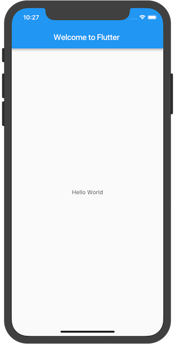

# Brief Introduction of Flutter
<p align="right">1813045 于海龙 2021.03.10</p>
<hr/>
<div align="right">

</div>

### 概要介绍
Flutter是由Google公司开发的开源跨平台框架，在近期的2.0发布版本中，Flutter移除了仅支持移动设备跨平台的限制，其拓展了对Web和桌面的支持。世界上众多的软件已经采用了Flutter框架进行开发，其中包括了WeChat和Google的众多产品。Flutter采用由Google开发的Dart语言进行开发。Dart语言是免费开源语言，其具有高可移植性，源代码可以被变编译为高性能的Intel和ARM机器代码，也可以生成优化的JavaScript代码。Flutter支持开发Android、iOS、Linux和Web应用。除此之外，Flutter拥有相对完善的官方文档，对于开发人员相对友好。在跨平台开发方面性能良好，平台支持相对丰富，拥有不错的发展前景。
其架构图如下：


### 安装配置
Flutter可以在Windows、Linux、MacOS甚至是Chrome OS系统上进行开发工作。其也对苹果新Arm架构的M1处理器进行了支持。安装Flutter SDK和Android SDK即可完成环境的配置。可以通过以下命令检查依赖环境配置是否正确。
```Shell
flutter doctor
```
Flutter可以在Android Studio、Intellij IDEA和Visual Studio Code软件内安装插件并进行Android应用代码开发，使用Xcode进行iOS应用的代码开发。使用真机连接电脑，打开USB调试并信任电脑即可接入Android Studio进行调试，也可以下载模拟器运行程序。


### 示例代码
在集成开发环境中创建工程项目，并修改`main.dart`的代码如下：
```Dart
import 'package:flutter/material.dart';

void main() => runApp(MyApp());

class MyApp extends StatelessWidget {
  @override
  Widget build(BuildContext context) {
    return MaterialApp(
      title: 'Welcome to Flutter',
      home: Scaffold(
        appBar: AppBar(
          title: Text('Welcome to Flutter'),
        ),
        body: Center(
          child: Text('Hello World'),
        ),
      ),
    );
  }
}
```
第一个测试程序就编写完成了，其运行的结果为：
<center class="half">


</center>


### 总结
Flutter作为一种开源免费的跨平台开发框架，其使用了开源免费的Dart语言，能编译出性能良好，可移植性强的程序，极大程度上简化了跨平台软件开发的难度。其功能相对完善，用户界面美观，可以说是目前为止最为出色的跨平台开发框架之一。
